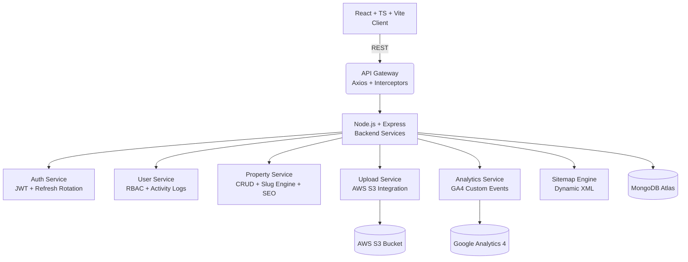

# 🏡 Inversiones Inteligentes — Production-Grade Real Estate Platform  

> ⚠️ **Note**  
> This repository includes the *full production frontend* and a **safe public backend demo**.  
> The real production backend is private (security reasons), but this demo backend contains  
> the exact architecture, patterns, conventions and structure used in production —  
> enough for recruiters to evaluate my full-stack capabilities.
> 
<div align="left">
  
  
  
  
</div>

A fully engineered, cloud‑ready real estate platform built with a modern, scalable, and production‑grade architecture.  
Developed by **Samuel Encarnación — Full‑Stack Developer | ITLA Graduate | ICC Student (PUCMM)**.

🔗 **Live Production:** https://inversionesinteligentesrd.com  
🛠 **Technologies:** React · TypeScript · Node.js · Express · MongoDB · AWS S3 · GA4 · Vite  

---

# 🚀 1. Introduction  
This platform powers the operations of a real estate business in the Dominican Republic.  
It includes:

- A public website optimized for SEO, speed, and conversions.  
- A secure admin panel to manage properties, images, users, roles, analytics, and system activity.  
- A fully decoupled architecture with robust authentication, cloud media storage, and analytics tracking.

This project reflects senior‑level engineering principles: modularity, scalability, security, cloud readiness, caching strategy, clean API design, and long‑term maintainability.

---

# 🏗 2. System Architecture (High-Level)


## Vista General

### Home


### Dashboard


### Propiedades


### ➕ Crear Propiedad


### Usuarios


### ➕ Crear Usuario

---

# ⭐ 3. Core Capabilities (Production Ready)

### 🔐 **Security & Authentication**
- JWT Access + Refresh Token Rotation  
- HttpOnly Secure Cookies (prod)  
- Account locking & rate limiting  
- Input sanitization, validation, XSS protection  
- Role‑Based Access Control (superadmin, admin, agent)

### 🏡 **Property Management**
- Full CRUD  
- Multi-image upload with AWS S3  
- Automatic slug generation  
- Featured mode, public/private mode  
- Geolocation support  
- Fully responsive optimized gallery

### 👥 **User & Roles**
- CRUD, filters, pagination  
- Activity logs  
- Account lock/unlock  
- Email verification  
- Role switching (RBAC)

### 📈 **Analytics & SEO**
- GA4 custom events  
- Pageview tracking  
- Search & filter events  
- Dynamic `sitemap.xml`  
- Optimized metadata + slugs

### 🖥 **Frontend (Public + Dashboard)**
- React + TypeScript + Vite  
- TailwindCSS + GSAP animations  
- Clean UI/UX patterns  
- Global Auth Context  
- Axios interceptors for automatic refresh  
- Modular hooks system

---

# ⚙️ 4. Technology Stack

| Layer | Technologies |
|------|--------------|
| **Frontend** | React, TypeScript, Vite, TailwindCSS, GSAP, Axios, React Router |
| **Backend** | Node.js, Express, Mongoose, JWT, Helmet, CORS, Multer, AWS SDK |
| **Cloud** | AWS S3, Railway, MongoDB Atlas |
| **Analytics** | Google Analytics 4 (Custom Events + Pageviews) |
| **Developer Tools** | GitHub, Prettier, ESLint |

---

# 🔒 5. Security Architecture
```
✔ Dual Token System (Access + Refresh)
✔ Secure Cookies (HttpOnly + SameSite + Secure)
✔ Anti‑Bruteforce (lockout)
✔ Input Sanitization + Validation Layer
✔ RBAC — Role Based Access Control
✔ Per‑User Logs (actions, dates, IP-safe)
✔ CORS restricted + Helmet secure headers
```

---

# 🧩 6. Main Modules

### **Auth Module**
- Register, Login, Logout  
- Refresh Token Rotation  
- Email Verification  
- Forgot/Reset Password Flow  
- Lock/Unlock Accounts  

### **User Module**
- CRUD  
- Pagination & Filters  
- Stats  
- Role Management  
- Activity Logs  

### **Property Module**
- CRUD  
- S3 Image Storage  
- Featured Properties  
- Search + Filtering  
- Public/Private Mode  
- SEO Slugs  

### **SEO/Analytics**
- Sitemap generation  
- GA4 integration (pageviews + custom events)  
- Metadata optimization  

---

# 🔧 7. Environment Variables

### **Backend**
```env
PORT=5001
NODE_ENV=production
MONGODB_URI=<mongo_url>
JWT_SECRET=<jwt_secret>
JWT_REFRESH_SECRET=<refresh_secret>

AWS_REGION=us-east-1
AWS_ACCESS_KEY_ID=<key>
AWS_SECRET_ACCESS_KEY=<secret>
AWS_S3_BUCKET=inversiones-inteligentes

RESEND_API_KEY=<resend>
EMAIL_FROM=<email>
EMAIL_FROM_NAME=Inversiones Inteligentes

GA_PROPERTY_ID=<ga_property>
GOOGLE_APPLICATION_CREDENTIALS=./credentials/analytics.json
```

### **Frontend**
```env
VITE_API_URL=<backend_url>
VITE_GA_TRACKING_ID=<ga_tracking>
VITE_GA_CLIENT_EMAIL=<analytics_email>
VITE_GA_PRIVATE_KEY=<analytics_key>
```

---

# 🚀 8. Deployment Strategy

| Component | Platform |
|----------|----------|
| **Frontend** | Railway |
| **Backend**  | Railway |
| **Database** | MongoDB Atlas |
| **Media Storage** | AWS S3 |
| **Analytics** | GA4 |

---

# 👨‍💻 9. About the Developer
**Samuel Encarnación** — Full‑Stack Developer  
ITLA Graduate · ICC Student at PUCMM

Experienced in:

- Production-grade web applications  
- Scalable architectures  
- Cloud integrations (AWS, GA4, MongoDB Atlas)  
- Secure authentication systems  
- Advanced UI/UX with animations  
- SEO technical optimization  
- API design & system modularity  

---

# 📄 License
© 2025 — Inversiones Inteligentes.  
Developed by **Samuel Encarnación**.
